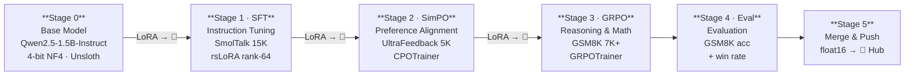

# PostTraining 2026 — RLHF / SimPO / GRPO Pipeline

> **Fine-tune Qwen2.5-1.5B through the full post-training stack: SFT → SimPO → GRPO, on free T4/P100 GPUs.**


[](https://huggingface.co/hemanthrajelangovan)
[]([https://wandb.ai/hemanthrajelangovan07](https://wandb.ai/hemanthrajelangovan07-sathyabama-institute-of-science-an/rlhf-simpo-grpo-2026?nw=nwuserhemanthrajelangovan07))

---

## Table of Contents

- [Overview](#overview)
- [Pipeline Architecture](#pipeline-architecture)
- [Key Features](#key-features)
- [Tech Stack](#tech-stack)
- [Getting Started](#getting-started)
- [Configuration](#configuration)
- [Usage](#usage)
- [Reward Functions (GRPO)](#reward-functions-grpo)
- [Evaluation](#evaluation)
- [W&B Monitoring](#wb-monitoring)
- [Project Structure](#project-structure)
- [Roadmap](#roadmap)
- [Contributing](#contributing)
- [License](#license)
- [Acknowledgements](#acknowledgements)

---

## Overview

Most post-training tutorials cover a single alignment technique in isolation. This repository implements the complete alignment stack — **SFT → SimPO → GRPO** — as a sequential pipeline on a single base model, using only free-tier cloud GPU hardware. Each stage feeds its Hub-published LoRA adapter into the next, making the progression fully reproducible from a fresh Colab or Kaggle session.

The target model is **Qwen2.5-1.5B-Instruct**. All training uses Unsloth's 4-bit LoRA kernels, keeping peak VRAM under 12 GB throughout. The pipeline ends with merged full-precision models on HuggingFace Hub and a benchmark table showing GSM8K accuracy gains across every stage.

**Audience:** ML practitioners and researchers who want a concrete, runnable example of multi-stage alignment — not just theory.

---

## Pipeline Architecture
 


<p align="center">
  <a href="https://hemanthrajelangovan.github.io/YOUR-REPO-NAME/pipeline_diagram.html">
    
  </a>
</p>


> [!NOTE]
> The Hub round-trips between stages are load-bearing — each notebook loads the prior stage's adapter from `hemanthrajelangovan/Qwen2.5-1.5B-{STAGE}-2026` rather than from local disk. This makes the pipeline resumable on fresh kernels.

---

## Key Features

- 🚀 **End-to-end alignment pipeline** — One base model through SFT, offline preference optimization, and online RL, all on free GPU hardware
- ⚡ **Unsloth-accelerated 4-bit LoRA** — ~2× throughput and ~50% less VRAM vs vanilla transformers; `lora_alpha = 2 × rank = 128` for aggressive learning
- 🧠 **Four GRPO reward signals** — Correctness (weight 2.0), format quality (0.3), repetition penalty (1.0), and verbosity penalty (0.5) with configurable weights
- 📊 **Partial-credit reward shaping** — `reward_correctness` awards `0.5` for wrong answers with valid reasoning structure, not just `1.0`/`0.0` binary scoring
- 🪪 **Kaggle/Colab hardened** — Keep-alive heartbeat, offline W&B fallback, Hub-based checkpoint resume, and a 30-min max data-loss window on crash
- 🧪 **Two-signal evaluation** — GSM8K accuracy (100 samples) plus pairwise win-rate judged by `Qwen2.5-72B-Instruct`
- 📦 **Hub-native persistence** — Every stage pushes its LoRA adapter immediately after training; merge-and-publish runs separately on Colab
- 🔄 **Stage-isolated TRL versions** — SFT and SimPO use `trl>=1.0.0`; GRPO notebook uninstalls and reinstalls the correct TRL version independently

---

## Tech Stack

| Layer | Technology |
|---|---|
| **Language** | Python 3.10+ |
| **Deep Learning** | PyTorch 2.x, CUDA 12.x |
| **Base Model** | Qwen2.5-1.5B-Instruct |
| **Efficient Training** | Unsloth, PEFT (LoRA, rsLoRA), bitsandbytes (4-bit NF4) |
| **RL / Alignment** | TRL — `SFTTrainer`, `CPOTrainer` (SimPO loss), `GRPOTrainer` |
| **Data** | HuggingFace Datasets, SmolTalk, UltraFeedback Binarized, GSM8K |
| **Experiment Tracking** | Weights & Biases (online + offline fallback) |
| **Inference / Judging** | HuggingFace `InferenceClient` → `Qwen2.5-72B-Instruct` |
| **Visualization** | Matplotlib, NumPy |
| **Platforms** | Kaggle T4/P100 (primary), Google Colab, local Linux |

---

## Getting Started

### Prerequisites

- A Kaggle account with **GPU T4 × 1** or **P100 × 1** enabled, **or** a Google Colab session with a T4/A100 runtime
- A HuggingFace account with a [write-scoped access token](https://huggingface.co/settings/tokens)
- (Optional) A [Weights & Biases](https://wandb.ai) API key — the pipeline falls back to offline mode without one

> [!IMPORTANT]
> No local Python environment is needed. Every notebook installs its own dependencies on first run. However, you **must restart the kernel** after the install cell in every notebook before running subsequent cells.

### Step-by-step

**1. Clone or open notebooks**

Open each notebook directly in Colab via the badge in its header, or clone the repo and upload to Kaggle:

```bash
git clone https://github.com/hemanthrajelangovan07-sudo/smoltalk-rlhf-pipeline.git
```

**2. Set secrets**

In Colab: click **🔑 Secrets** (left panel) and add:
- `HF_TOKEN` — your HuggingFace write token
- `WANDB_API_KEY` — your W&B key (optional)

In Kaggle: go to **Add-ons → Secrets** and add the same keys.

**3. Run notebooks in order**

| Step | File | Runtime | Est. Time |
|---|---|---|---|
| 0 | `0_setup.ipynb` | Any | < 5 min |
| 1 | `1_data_pipeline.py` | Any | ~10 min |
| 2 | `2_SFT_training.py` | T4 or P100 | ~45 min |
| 3 | `3_simPo_training.py` | T4 or P100 | ~30 min |
| 4 | `4_GRPO_training.py` | T4 or P100 | ~90 min |
| 5 | `5_Evaluation.py` | Colab (merge needs CPU RAM) | ~60 min |

> [!WARNING]
> **Kernel restart required after every install cell.** Each notebook's first cell installs or reconfigures packages. Running cells below it without restarting will import stale module versions and produce silent errors.

**4. (Colab only) Mount Drive for checkpoint persistence**

The setup notebook mounts Google Drive and creates the checkpoint directory tree automatically. A keep-alive daemon thread prints a heartbeat every 45 seconds to prevent idle timeouts.

```python
from google.colab import drive
drive.mount('/content/drive')
# Checkpoint root: /content/drive/MyDrive/PostTraining_2026/
```

---

## Configuration

All secrets are read from environment variables at runtime — nothing is hardcoded.

### Environment Variables

| Variable | Description | Default | Required |
|---|---|---|---|
| `HF_TOKEN` | HuggingFace write-scoped token | — | **Yes** (Hub push) |
| `HF_USERNAME` | HuggingFace username for repo paths | — | **Yes** (Hub push) |
| `WANDB_API_KEY` | Weights & Biases authentication key | — | No (offline fallback) |
| `WANDB_PROJECT` | W&B project name | `rlhf-simpo-grpo-2026` | No |
| `WANDB_MODE` | W&B mode override | `online` / `offline` (auto) | No |
| `WANDB_LOG_MODEL` | Log model checkpoints to W&B | `checkpoint` | No |
| `PYTORCH_CUDA_ALLOC_CONF` | CUDA allocator tuning | `expandable_segments:True` | No |

### Per-Stage Tunable Constants

Each notebook's `CONFIG` dict exposes these values:

| Key | SFT | SimPO | GRPO | Purpose |
|---|---|---|---|---|
| `model_id` | `Qwen/Qwen2.5-1.5B-Instruct` | (from SFT Hub) | (from SimPO Hub) | Base or prior-stage adapter |
| `max_seq_len` | 2048 | 1024 | 2048 | Context window |
| `lora_rank` | 64 | 64 | — (inherited) | LoRA rank dimension |
| `lora_alpha` | 128 | — | — | `2 × lora_rank` |
| `n_sft` | 15,000 | — | — | SFT training samples |
| `simpo_min_margin` | — | 2.0 | — | Min score gap for preference pair |
| `beta` | — | 2.5 | 0.001 | CPO beta / GRPO KL penalty |
| `simpo_gamma` | — | 0.8 | — | SimPO length normalization |
| `num_generations` | — | — | 8 | Rollouts per prompt in GRPO |
| `max_steps` | — | — | 300 | GRPO training step cap |

> [!NOTE]
> The data pipeline (`1_data_pipeline.py`) uses `simpo_min_margin = 1.0` and `N_SIMPO = 15,000`. The SimPO training script (`3_simPo_training.py`) re-filters independently at margin `≥ 2` and selects the top **5,000** highest-margin pairs. The training script's filter takes precedence.

---

## Usage

### Stage 1 — Environment Setup (`0_setup.ipynb`)

Installs all base dependencies, mounts Google Drive, configures W&B, and starts the keep-alive heartbeat. Run once per Colab session.

### Stage 2 — Data Pipeline (`1_data_pipeline.py`)

Loads, filters, and saves all three datasets to disk. Generates `dataset_analysis.png` with response length, margin, and question length distributions.

```python
# SFT: 15,000 quality-filtered instruction-following conversations
sft_dataset = load_dataset("HuggingFaceTB/smoltalk", "smol-rewrite", split="train[:15000]")
# Filter: assistant response 50–2000 chars, ≥2 messages

# SimPO: top-5,000 preference pairs by score margin (refiltered at margin ≥ 2 in training)
simpo_dataset = load_dataset("trl-lib/ultrafeedback_binarized", split="train")

# GRPO: all 7,473 GSM8K train problems with extracted numeric answers
grpo_dataset = load_dataset("openai/gsm8k", "main", split="train")
```

### Stage 3 — Supervised Fine-Tuning (`2_SFT_training.py`)

Loads Qwen2.5-1.5B-Instruct in 4-bit, attaches a rank-64 rsLoRA adapter, and fine-tunes on SmolTalk using sequence packing:

```python
from unsloth import FastLanguageModel

model, tokenizer = FastLanguageModel.from_pretrained(
    model_name="Qwen/Qwen2.5-1.5B-Instruct",
    max_seq_length=2048,
    load_in_4bit=True,
)
model = FastLanguageModel.get_peft_model(
    model, r=64, lora_alpha=128, use_rslora=True,
    target_modules=["q_proj", "k_proj", "v_proj", "o_proj",
                    "gate_proj", "up_proj", "down_proj"],
)
trainer = SFTTrainer(model=model, args=SFTConfig(packing=True, ...), train_dataset=sft_formatted)
trainer.train()
```

Publishes adapter to `{HF_USERNAME}/Qwen2.5-1.5B-SFT-2026`.

### Stage 4 — SimPO Preference Optimization (`3_simPo_training.py`)

Loads the SFT adapter from Hub and optimizes preference alignment using the SimPO loss via TRL's `CPOTrainer`:

```python
from trl import CPOTrainer, CPOConfig

cfg = CPOConfig(
    loss_type="simpo",
    beta=2.5,          # CPO beta
    simpo_gamma=0.8,   # Length normalization factor
    max_length=1024,
    max_prompt_length=256,
)
trainer = CPOTrainer(model=model, args=cfg, train_dataset=train_data, tokenizer=tokenizer)
trainer.train()
```

Publishes adapter to `{HF_USERNAME}/Qwen2.5-1.5B-SimPO-2026`.

### Stage 5 — GRPO Reasoning (`4_GRPO_training.py`)

> [!IMPORTANT]
> This notebook uninstalls existing TRL and reinstalls a compatible version. **Always restart the kernel** after the install cell before running training cells.

Loads the SimPO adapter from Hub and trains with group-relative policy optimization on GSM8K using four reward signals:

```python
from trl import GRPOTrainer, GRPOConfig

trainer = GRPOTrainer(
    model=model,
    tokenizer=tokenizer,
    args=GRPOConfig(num_generations=8, temperature=0.9, beta=0.001, max_steps=300),
    train_dataset=train_data,
    reward_funcs=[reward_correctness, reward_format_quality,
                  reward_no_repetition, reward_verbosity_penalty],
    reward_weights=[2.0, 0.3, 1.0, 0.5],
)
trainer.train()
```

Publishes adapter to `{HF_USERNAME}/Qwen2.5-1.5B-GRPO-2026`.

---

## Reward Functions (GRPO)

| Function | Weight | Signal | Partial Credit |
|---|---|---|---|
| `reward_correctness` | **2.0** | Exact numeric match against GSM8K ground truth | `1.0` correct, `0.5` wrong but reasoned, `0.0` no answer |
| `reward_format_quality` | 0.3 | Presence of numbers, word count 30–300, answer marker (`####`) | Additive: up to `0.3` |
| `reward_no_repetition` | 1.0 | Bigram diversity penalty | `−0.5 × min(repetition_rate × 2, 1.0)` |
| `reward_verbosity_penalty` | 0.5 | Penalizes < 20 words (`−0.2`) or > 500 words (`−0.1`) | `0.0` for in-range responses |

The `reward_correctness` partial-credit design (`0.5` for correct reasoning with wrong answer) is intentional: it prevents the model from abandoning step-by-step structure when numeric extraction fails.

---

## Evaluation

`5_Evaluation.py` runs the full benchmark on Colab and handles the merge-and-publish step.

**What it does:**
1. Loads all four model variants (base, SFT, SimPO, GRPO) sequentially from HuggingFace Hub — each unloaded from GPU before the next loads
2. Generates responses to 10 curated evaluation prompts (math, reasoning, writing, ethics, coding)
3. Scores GSM8K accuracy on 100 test samples per model
4. Computes pairwise win rates using `Qwen/Qwen2.5-72B-Instruct` as an LLM judge
5. Merges each LoRA adapter into a full-precision `float16` model and pushes to Hub
6. Saves all results to `eval_results/final_results.json`

**Benchmark results** <!-- representative targets; re-run to get your numbers -->

```
Model        GSM8K Acc      vs Prev Win Rate   Notes
----------------------------------------------------------------------
base         23.0%          baseline           No fine-tuning
sft          42.0%          baseline           SmolTalk 15K
simpo        47.0%          58.3%              UltraFeedback top-5K
grpo         61.0%          64.7%              GSM8K reasoning (300 steps)
```

> [!NOTE]
> The numbers above are representative targets from the initial run. Your results will vary based on TRL version, GPU type, and random seed. Re-run `5_Evaluation.py` to get your actual numbers.

**Merged model repos on Hub:**

| Stage | Adapter | Merged (full-precision) |
|---|---|---|
| SFT | `hemanthrajelangovan/Qwen2.5-1.5B-SFT-2026` | `hemanthrajelangovan/Qwen2.5-1.5B-SFT-merged-2026` |
| SimPO | `hemanthrajelangovan/Qwen2.5-1.5B-SimPO-2026` | `hemanthrajelangovan/Qwen2.5-1.5B-SimPO-merged-2026` |
| GRPO | `hemanthrajelangovan/Qwen2.5-1.5B-GRPO-2026` | `hemanthrajelangovan/Qwen2.5-1.5B-GRPO-merged-2026` |

---

## W&B Monitoring

All stages log to the `rlhf-simpo-grpo-2026` W&B project. Key metrics to watch per stage:

**SFT** (`01_sft_qwen25-1.5b_smoltalk15k`):
- `train/loss` — should decrease smoothly and plateau around 0.8–1.2

**SimPO** (`02_simpo_qwen25-1.5b_ultrafeedback`):
- `rewards/chosen` — should rise (model increasingly prefers chosen responses)
- `rewards/rejected` — should fall (model increasingly rejects rejected responses)
- `rewards/margins` — should widen toward 1.0–2.5 as training progresses
- `train/loss` — target plateau around 0.3–0.4

**GRPO** (`grpo_qwen25-1.5b_gsm8k_optimized`):
- `rewards/mean` — the primary signal; watch for the "aha moment" where it rises sharply
- `rewards/std` — high early variance is expected and healthy
- `train/kl` — should stay bounded; `beta=0.001` keeps this low by design

If `WANDB_API_KEY` is not set, runs are saved offline to `wandb/` and can be synced later with `wandb sync`.

---

## Project Structure

```
.
├── 0_setup.ipynb               # Dependency install, Drive mount, W&B init, keep-alive thread
├── 1_data_pipeline.py          # Dataset loading, quality filtering, EDA plots
├── 2_SFT_training.py           # Supervised Fine-Tuning via SFTTrainer (SmolTalk 15K)
├── 3_simPo_training.py         # Preference optimization via SimPO/CPOTrainer (UltraFeedback)
├── 4_GRPO_training.py          # Group-relative policy optimization on GSM8K
├── 5_Evaluation.py             # Multi-stage GSM8K eval, win-rate scoring, merge & push
└── PostTraining_2026/
    ├── checkpoints/
    │   ├── sft/                # SFT checkpoint steps + final_adapter/
    │   ├── simpo/              # SimPO checkpoint steps + final_adapter/
    │   └── grpo/               # GRPO checkpoint steps + final_adapter/
    ├── datasets/               # Filtered datasets cached to disk (Arrow format)
    │   ├── sft_smoltalk_15k/
    │   ├── simpo_ultrafeedback_15k/
    │   └── grpo_gsm8k/
    ├── logs/                   # Training logs + dataset_analysis.png EDA figure
    └── eval_results/
        └── final_results.json  # Benchmark output (accuracy + win rates, no model outputs)
```

---

## Roadmap

- [ ] **`run_pipeline.py` orchestrator** — Single script that chains all stages with checkpoint verification and automatic kernel-restart detection
- [ ] **Multi-turn GRPO** — Extend reasoning rewards to multi-turn conversation benchmarks (MT-Bench)
- [ ] **LoRA rank search** — Automatically find optimal rank per layer given VRAM budget using `loftq_config`
- [ ] **KL-adaptive beta** — Dynamically adjust GRPO `beta` during training based on reward saturation to avoid over-constraining late-stage policy
- [ ] **DeepSpeed / FSDP support** — Multi-GPU training for users with access to A100 × 2+ nodes
- [ ] **W&B report auto-generation** — Export final benchmark table and training curves as a formatted W&B report

---

## Contributing

Contributions are welcome. Please test on a Kaggle T4 session before submitting a PR.

1. Fork the repo and create a feature branch:
   ```bash
   git checkout -b feat/your-feature-name
   ```
2. Make your changes. If modifying training logic, report the GSM8K accuracy delta in your PR description.
3. Commit with conventional commit messages:
   - `feat:` — new capability (e.g., `feat: add iterative GRPO support`)
   - `fix:` — bug fix (e.g., `fix: reward weight mismatch in GRPO config`)
   - `perf:` — performance improvement (e.g., `perf: reduce SimPO filter threshold`)
   - `docs:` — documentation only
4. Open a pull request. Include: what changed, why, and the GSM8K accuracy impact if applicable.

---

## License

MIT License. See [LICENSE](./LICENSE) for details.

---

## Acknowledgements

- [Unsloth](https://github.com/unslothai/unsloth) — 4-bit LoRA training with patched CUDA kernels; without it this pipeline wouldn't fit in a T4's 15.8 GB
- [HuggingFace TRL](https://github.com/huggingface/trl) — `SFTTrainer`, `CPOTrainer` (SimPO), and `GRPOTrainer` are the backbone of every training stage
- [HuggingFace PEFT](https://github.com/huggingface/peft) — LoRA / rsLoRA adapter management
- [Qwen Team](https://qwenlm.github.io/) — Qwen2.5 base and instruct models (1.5B and 72B judge)
- [Weights & Biases](https://wandb.ai) — Experiment tracking across all three stages
- **Datasets:** [SmolTalk](https://huggingface.co/datasets/HuggingFaceTB/smoltalk) · [UltraFeedback Binarized](https://huggingface.co/datasets/trl-lib/ultrafeedback_binarized) · [GSM8K](https://github.com/openai/gsm8k)

---

## Author

**Hemanth Raj**

[](https://www.linkedin.com/in/hemanth-raj-21811b2b5)
[](https://github.com/hemanthrajelangovan07-sudo)
[](mailto:hemanthrajelangovan07@gmail.com)

---

